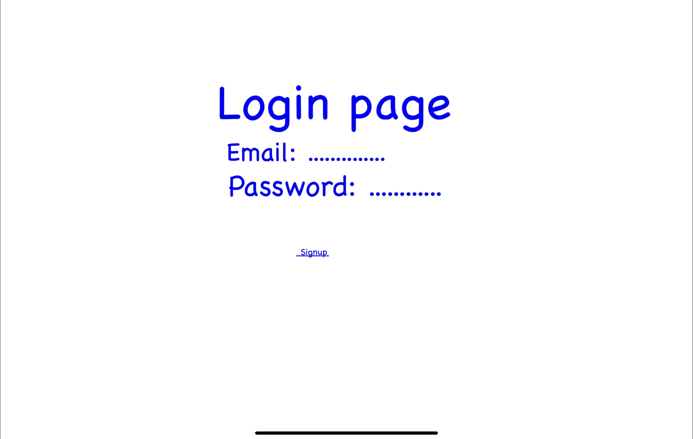
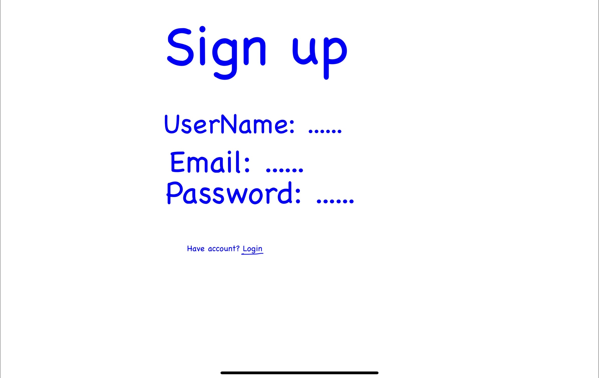
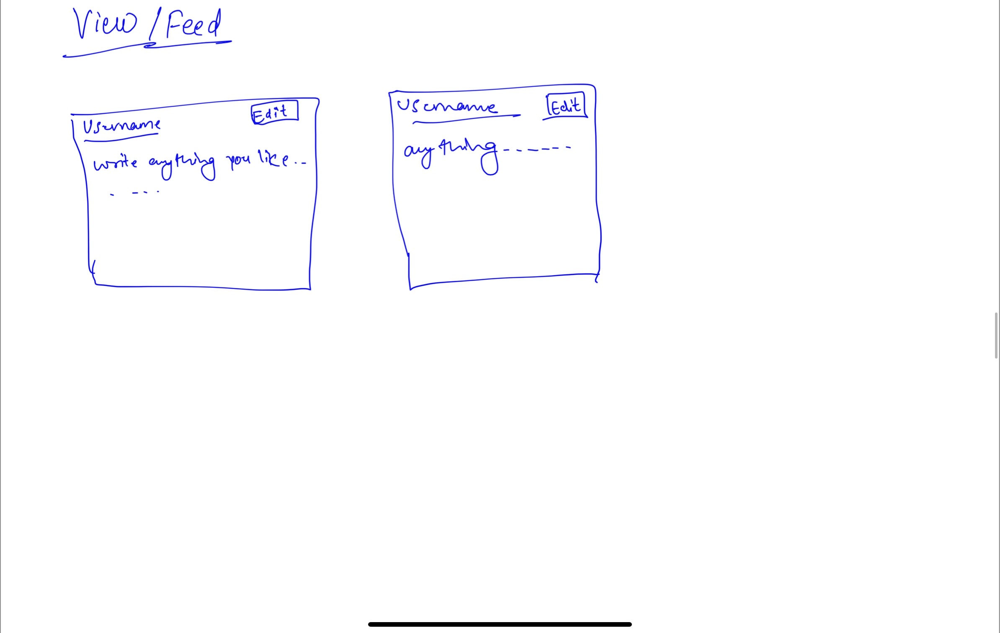
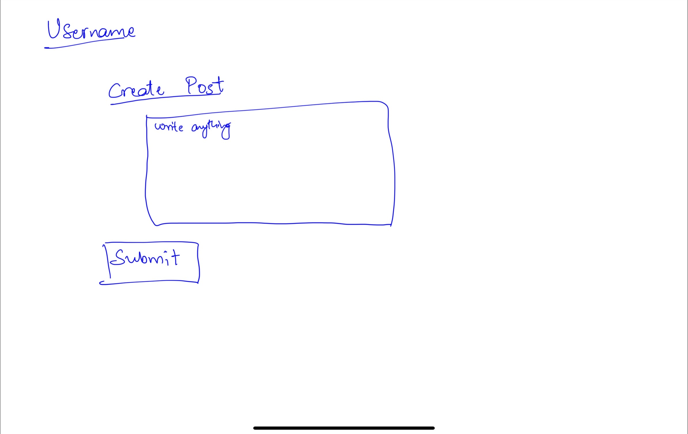
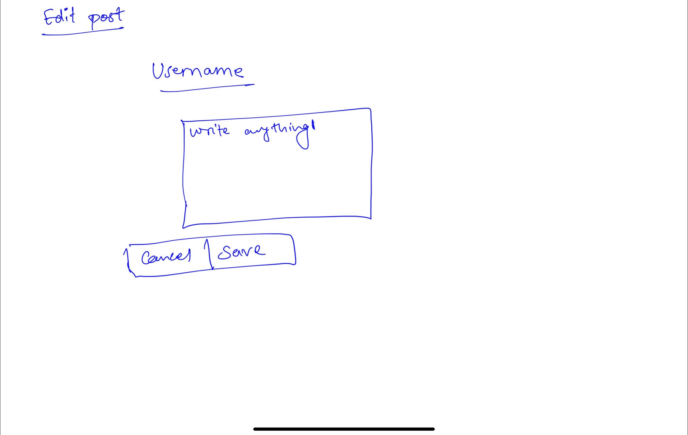
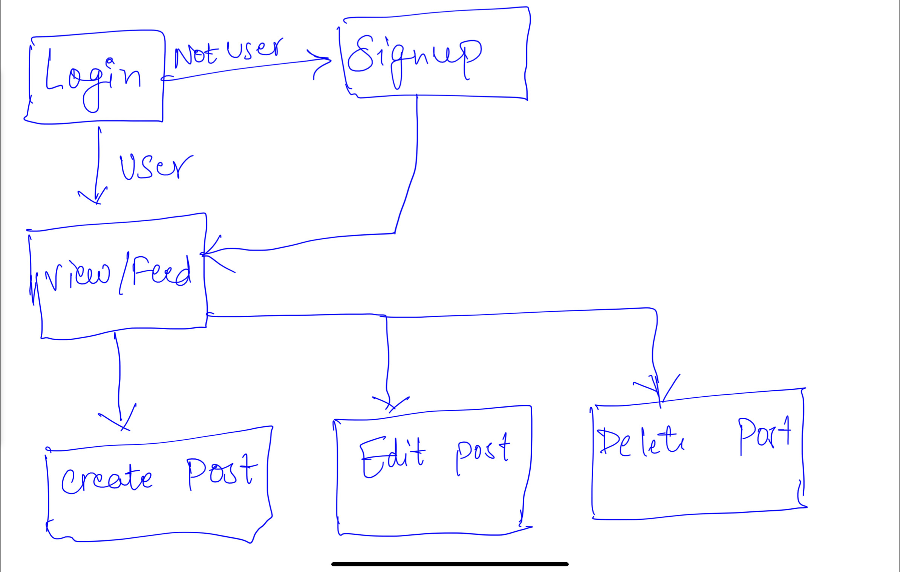

# [Writterrr](http://44.202.59.88:3000/login) 

## Overview

<!--- (__TODO__: a brief one or two paragraph, high-level description of your project) -->

Have you ever tried editing feature in Twitter? Were you able to edit your content after you have posted? Why does this feature only limit to BlueTick Members? Sooo... that's where Writterrr comes in!

Writterrr is a web app that will allow users to posts anything they want. Users can register and login. Once they're logged in, they can create or view their own posts. For every content that they post, they can use edit function easily. The Live view is [here](http://44.202.59.88:3000/login).


## Data Model

<!--- (__TODO__: a description of your application's data and their relationships to each other)  -->

The application will store Users, Contents and the Times created at.


<!--- (__TODO__: sample documents) -->

An Example User:

```javascript
{
  email: "useremail",
  password: // a password hash,
}
```

An Example List with Embedded Features:

```javascript
{
  title: //title of the post
  description: //description of the post
  content: //content
  createdAt: //timestamp
}
```


## [Link to Schemas](db.mjs) 

<!--- (__TODO__: create a first draft of your Schemas in db.mjs and link to it) --->

## Wireframes

<!---  (__TODO__: wireframes for all of the pages on your site; they can be as simple as photos of drawings or you can use a tool like Balsamiq, Omnigraffle, etc.) --->

/login - page for logging into account



/signup - page for signing up for account



/view - page for showing posts



/create - page for creating posts



/edit - page for editing posts



/delete - page for deleting post

Delete the post

## Site map

Site Map Rough Draft


<!---(__TODO__: draw out a site map that shows how pages are related to each other)

Here's a [complex example from wikipedia](https://upload.wikimedia.org/wikipedia/commons/2/20/Sitemap_google.jpg), but you can create one without the screenshots, drop shadows, etc. ... just names of pages and where they flow to. -->

## User Stories or Use Cases

<!--- (__TODO__: write out how your application will be used through [user stories](http://en.wikipedia.org/wiki/User_story#Format) and / or [use cases](https://en.wikipedia.org/wiki/Use_case))-->

1. as non-registered user, I can register a new account
2. as a user, I can log in
3. as a user, I can create a new post
4. as a user, I can view all of the posts already created. 
5. as a user, I can edit my posts.
6. as a user, I can delete my posts.

## Research Topics

<!---(__TODO__: the research topics that you're planning on working on along with their point values... and the total points of research topics listed)-->

*  Integrate user authentication using JSON Web Token Tool

* Use a CSS framework
    * Bootstrap (Used in home file)
* Perform client side form validation using a JavaScript library (--tbd)

<!--- 10 points total out of 8 required points (___TODO__: addtional points will __not__ count for extra credit) --->


## [Link to Main Project File](app.mjs) 

<!--- (__TODO__: create a skeleton Express application with a package.json, app.mjs, views folder, etc. ... and link to your initial app.mjs)
-->

## Annotations / References Used

<!--- (__TODO__: list any tutorials/references/etc. that you've based your code off of)

1. [passport.js authentication docs](http://passportjs.org/docs) - (add link to source code that was based on this)
2. [tutorial on vue.js](https://vuejs.org/v2/guide/) - (add link to source code that was based on this)
-->
1. [Make Schemas and slug](https://stackoverflow.com/questions/43286009/generate-a-unique-slug-on-mongoose-schema-pre-update)
2. [JWT Tool](https://www.section.io/engineering-education/how-to-build-authentication-api-with-jwt-token-in-nodejs/)
3. [AUthorization users](https://medium.com/@maison.moa/using-jwt-json-web-tokens-to-authorize-users-and-protect-api-routes-3e04a1453c3e)
 


